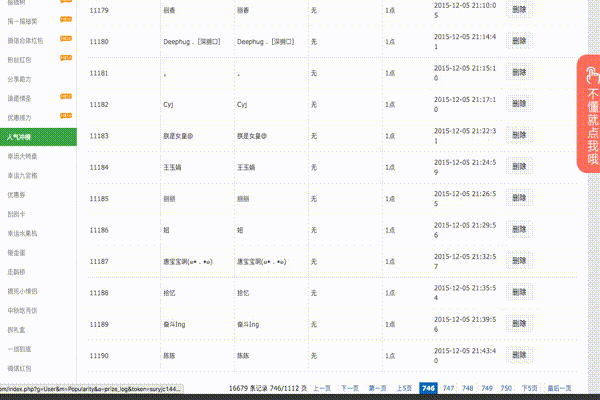

# 微信人家"人气冲榜"导出自动化

微信人家 (http://weixinrj.com) 有个"人气冲榜"栏目，如果有一万多粉丝，那么一共有几百页。可是这个网站暂时没有导出功能，只能做了自动化脚本实现。


导出的文件为 outputs.html，用浏览器打开后，复制粘贴到 Excel 表格里就可以进行排序筛选等其他操作。

# 运行前的准备

创建一个 input.json 文件，内容如下：

```
{
  "username": "你的用户名",
  "password": "你的密码"
}
```

# 运行

```
cucumber
```

# 注意事项
浏览器启动并打开登录页面后，会等待5秒等待输入验证码。你输入完验证码后等待即可，不要做任何操作，也不要去点击"登录"按钮，程序会自动去点击。
等待大约 20 分钟，即可完成工作。当然在等待的过程中你可以做的事情，不会影响程序的运行。

# 运行时的效果截屏


# 参考资料

https://github.com/jnicklas/capybara
http://www.rubydoc.info/github/jnicklas/capybara/master/Capybara/RackTest/Browser#html-instance_method
http://makandracards.com/makandra/9773-how-to-start-selenium-browser-maximized-or-with-custom-window-size
http://stackoverflow.com/questions/4071937/how-do-i-get-the-html-in-an-element-using-capybara
http://www.tutorialspoint.com/ruby/ruby_if_else.htm
http://ruby-doc.org/core-2.2.3/Array.html

# 附
这个运行效果截屏是这样做的：
在 Mac OSX 上打开 Quick Time，按 Alt+Command+N，开始录屏。录完屏后保存，默认是 mov 文件（默认路径在 icloud 文件夹里）。然后
```
brew install ffmpeg 
```
接着
```
brew install gifsicle
```
再用如下命令将 mov 文件转换成 gif
```
ffmpeg -i /Users/tianjie/Library/Mobile\ Documents/com\~apple\~QuickTimePlayerX/Documents/WeixinRJ.mov -s 600x400 -pix_fmt rgb24 -r 10 -f gif - | gifsicle --optimize=3 --delay=1 > out.gif
```
这里吐槽一下 Mac OSX，在 finder 中看到 iCloud 文件夹了，可是要找到它的路径写到命令行，却不知道该怎么办。最后用鼠标将文件拖放到 Terminal 上才列出了文件路径。

参考 http://www.th7.cn/system/mac/201502/83966.shtml。以上转换 gif 的命令解释如下：
参数说明:
```
-r 10 告诉 ffmpeg 将视频的帧率转成 10fps, 这样可以减小视频体积
-s 600x400 这是你的视频的尺寸, 600x400
--delay=10 告诉 gifsicle GIF 每帧之间的时间间隔是 100ms(也就是帧率为 10fps, 1000ms/10fps = 100ms = 10x10ms), gifsicle 使用的单位是 10ms, 不是 ms
--optimize=3 让 gifsicle 优化一下, 设置为 3 即可
```