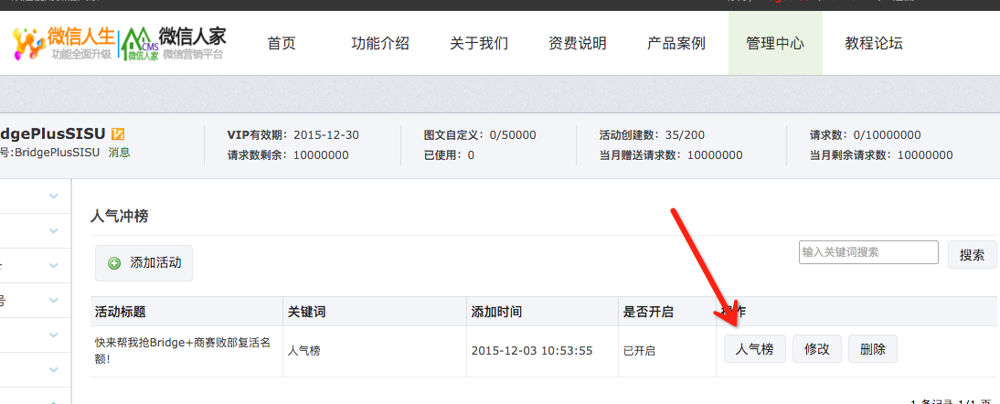

# 微信人家"人气冲榜"导出自动化
=================================
微信人家(http://weixinrj.com/)有个"人气冲榜"栏目，如果有一万多粉丝，那么一共有几百页。可是这个网站暂时没有导出功能，只能做了自动化脚本实现。



导出的文件为 outputs.html，用浏览器打开后，复制粘贴到 Excel 表格里就可以进行排序筛选等其他操作。

# 运行

```
cucumber
```

# 注意事项
浏览器启动并打开登录页面后，会等待5秒等待输入验证码。你输入完验证码后等待即可，不要做任何操作，也不要去点击"登录"按钮，程序会自动去点击。

# 参考资料
=================================
https://github.com/jnicklas/capybara
http://www.rubydoc.info/github/jnicklas/capybara/master/Capybara/RackTest/Browser#html-instance_method
http://makandracards.com/makandra/9773-how-to-start-selenium-browser-maximized-or-with-custom-window-size
http://stackoverflow.com/questions/4071937/how-do-i-get-the-html-in-an-element-using-capybara
http://www.tutorialspoint.com/ruby/ruby_if_else.htm
http://ruby-doc.org/core-2.2.3/Array.html